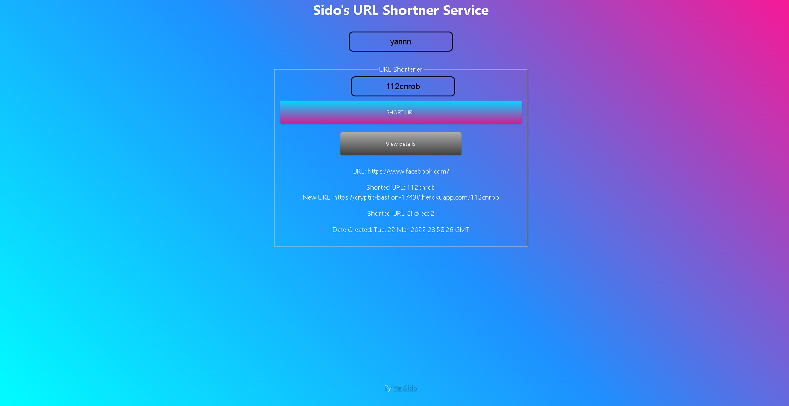

# Welcome to Sido's URL Shortner

## Table of contents
* [General info](#general-info)
* [Contributing](#contributing)
* [Contact](#contact)

## General info

Short your URLs and monitor them!

## Contributing

Contributions are what make the open source community such an amazing place to learn, inspire, and create. Any contributions you make are greatly appreciated.

1. Fork the Project
2. Create your Feature Branch
3. Commit your Changes
4. Push to the Branch
5. Open a Pull Request

## Contact

Github: [@Yan Sidorenko](https://github.com/YanSido)

Project Link: [Sido's URL Shortner](https://github.com/YanSido/cyber4s-final1-boilerplate-url-shortener/tree/YanSido-branch)

Heroku: [https://cryptic-bastion-17430.herokuapp.com/](https://cryptic-bastion-17430.herokuapp.com/)
